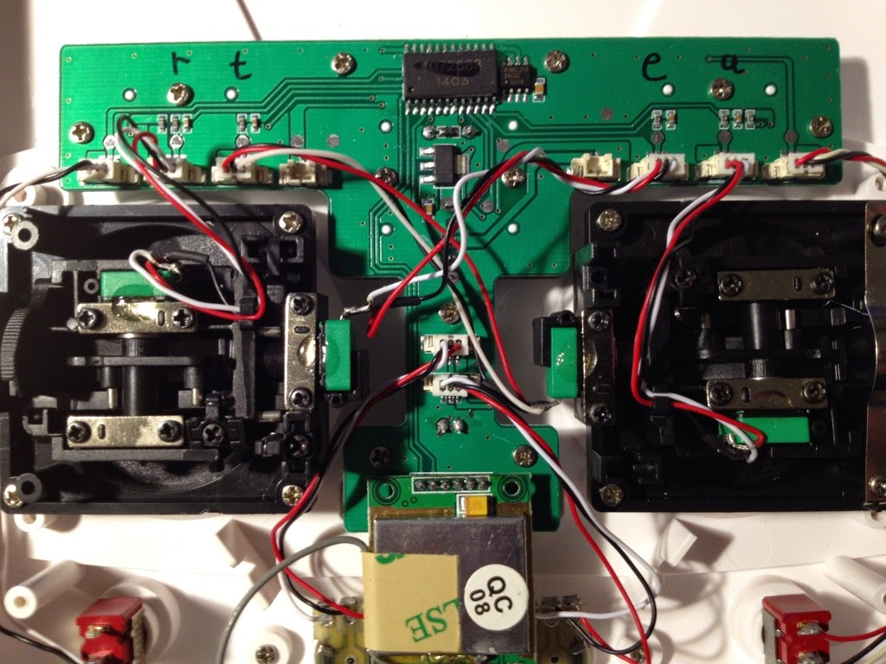
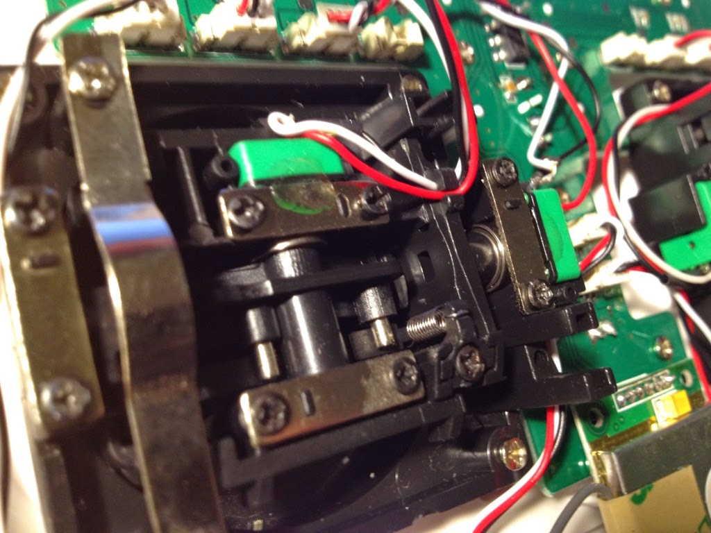

# Quanum Nova Quad Notes

## Mode 1 to Mode 2 convert

I want Mode 2 control configuration with propper gimbal feedback as you'd expect.
To convert the Nova Quanum controller simply open it up and swap the wires and tension springs.


```
+--------------------+          +-------------------+
|                    |          |                   |
|         ^          |          |         +         |
|         |          |          |     Pitch         |
|      Throttle      |          |         |         |
|         |          |          |         |         |
|  +-------------->  |          | +---------------> |
|         |          |          |         | Roll    |
|         |   Yaw    |          |         |         |
|         |          |          |         v         |
|         ^          |          |                   |
+---------+----------+          +-------------------+

```







